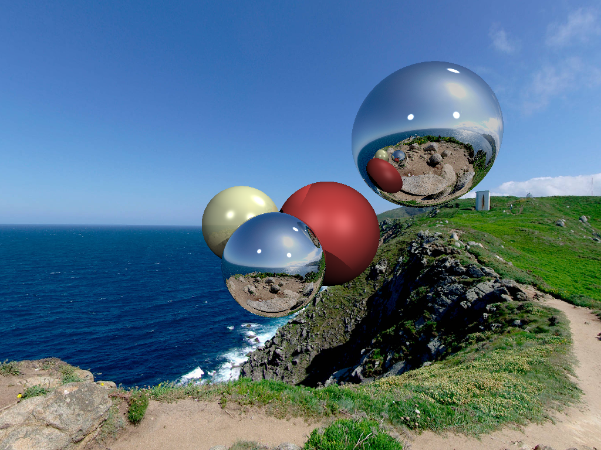

Simple ray traycing

Rust version of some basic stuff realted to the 3d graphics and light.

Generates picture with some spheres located in front of the spherical photo with some effects applied on them:

